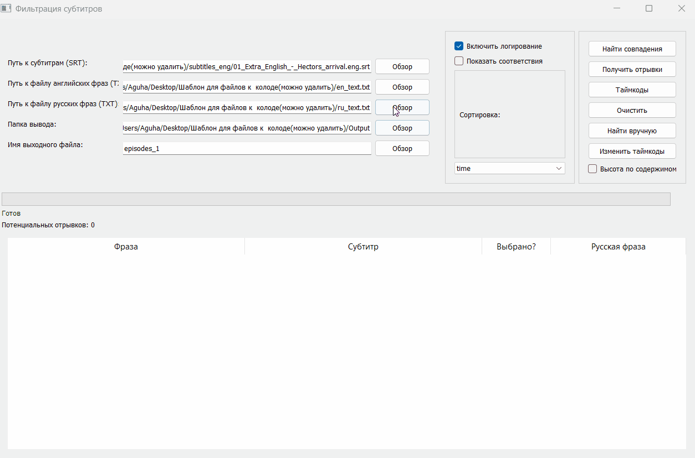

# 🎬 Video-to-Anki Automation Suite




**A comprehensive ETL (Extract, Transform, Load) pipeline for language learners.**
This suite automates the creation of high-quality Anki flashcards from raw video content, combining a **Desktop GUI** for precision work and **CLI tools** for batch processing.

---

## 🚀 Key Features (The "Why")
* **Smart Parsing (NLP):** Uses `pymorphy3` and Levenshtein distance to match phrases regardless of word forms (e.g., matches "go" with "going").
* **Concurrency:** Implements `QThread` and thread-safe DB locking to perform heavy parsing without freezing the UI.
* **Cloud Integration:** Connects to **Google Cloud TTS** to generate audio for phrases missing from the original video.
* **Data Integrity:** SQLite-based session management allows pausing and resuming large projects.

---

## 🏗️ Architecture & Components

The repository is structured as a monorepo containing two specialized tools:

### 1. Subtitle Processor (GUI)
*Located in `/tools/subtitle_extractor`*
**The Core Engine.** A desktop app for extracting context from movies.
* **Stack:** PyQt5, SQLite, FFmpeg.
* **Tech Highlight:** Uses a custom algorithm to interpolate sub-sentence timestamps based on word density distribution.
* **Feature:** Manual Override Mode allows patching missing data via external editor integration.

### 2. Anki Deck Builder (CLI)
*Located in `/tools/deck_builder`*
**The Assembler.** A script that packages data into `.apkg` files.
* **Stack:** Google Cloud API, GenAnki.
* **Tech Highlight:** Automates the "Copy-Paste" routine, reducing card creation time from **3 minutes** to **<5 seconds**.

---

## 🛠 Tech Stack Overview

| Category | Technologies used |
| :--- | :--- |
| **Core** | Python 3.10+, Threading, OOP |
| **Interface** | PyQt5 (Desktop GUI) |
| **Data & NLP** | SQLite, Pandas, Pymorphy3 (Lemmatization), Difflib (Fuzzy Matching) |
| **Media & API** | FFmpeg Wrapper, Google Cloud Text-to-Speech |

---

## 📂 Repository Structure (Monorepo)
```text
video-to-anki-automation/
├── tools/
│   ├── subtitle_extractor/  # GUI Application (PyQt5)
│   │   ├── app.py           # Entry point & Event Loop
│   │   ├── database.py      # Thread-safe SQLite wrapper
│   │   └── utils.py         # NLP & Math algorithms
│   │
│   └── deck_builder/        # Automation Script (CLI)
│       ├── main.py
│       └── api_client.py    # GCP Integration
│
├── data/                    # Shared input/output directory
├── requirements.txt         # Unified dependencies
└── README.md
```

## ⚙️ How to Run
Prerequisites
1. Python 3.10+
2. FFmpeg (Added to system PATH)

Installation
   ```bash
# Clone the repository
git clone [https://github.com/Andrei-Shishkov-QA/video-to-anki-automation.git](https://github.com/Andrei-Shishkov-QA/video-to-anki-automation.git)
# Install dependencies
pip install -r requirements.txt
   ```
Usage
To run the GUI (Subtitle Processor):
   ```bash
python tools/subtitle_extractor/app.py
   ```
To run the Deck Builder:
   ```bash
python tools/deck_builder/main.py --input "processed_data.json"
   ```
Developed by Andrei Shishkov. Focus: QA Automation, Tooling, and ETL Processes.
